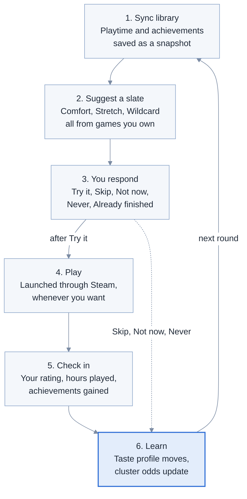
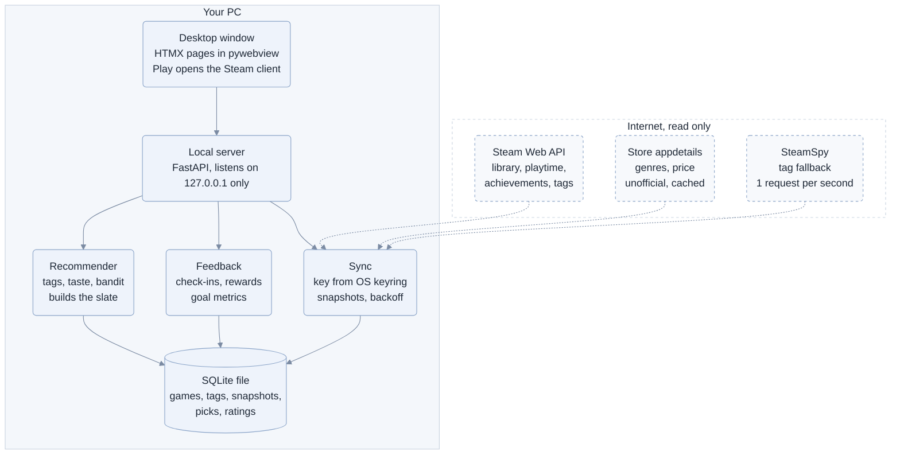

# Backlog Compass: MVP Design Doc

Oct 1, 2026 · @dwerkjem

## Overview

Backlog Compass (working name) is a desktop app that picks your next game from the Steam library you already own, learns from how each pick went, and picks again. Each round it offers a short slate of games, you play or skip them, and it scores the result from your own rating plus what Steam reports: hours played since the pick, achievements earned, and how far you got.

The problem it targets: most Steam libraries hold dozens of games bought and barely touched, while playtime piles into a few favorites, and the usual cure for boredom is buying something new. The bet is that a good picker turns the backlog into the "new game" and makes the next purchase less necessary.

The MVP is a single-user app that runs on your own PC, keeps all data locally, and needs only a free Steam Web API key and a public game-details setting on your Steam profile.

## Goals, non-goals, and success metrics

The MVP succeeds if, after a month of use, playtime is spread across more of the games you own, the picks are rated as enjoyable, and fewer new games get bought.

### Goals

1. More diverse play: spread hours across more games and more kinds of games.
2. More enjoyment: picks you rate well and keep playing.
3. More time in games you already own, measured as hours in picked games, not total hours, so the app is rewarded for finding good games rather than longer sessions.
4. Less money spent on new games.

### Non-goals for the MVP

- Suggesting games you do not own, now or later. The app assumes a large existing library, so every pick comes from it.
- Other stores (Epic, GOG, Xbox), multiple users, social features, mobile.
- Any cloud account or server; everything stays on your PC.

### Metrics

Targets are first guesses to revisit after real data.

| Metric | Definition | Source | Proposed target |
| --- | --- | --- | --- |
| Effective games played | exp(Shannon entropy) of hours across games, trailing 30 days | Playtime snapshots | Up 50% vs. baseline |
| Tag spread | Same entropy, computed over tag clusters instead of games | Snapshots + tags | Up vs. baseline |
| Pick success rate | Accepted picks with 2+ hours in 14 days and a rating of 3+ out of 5 | Snapshots + ratings | 40% or better |
| Enjoyment | Mean rating of picks you played | Ratings | 3.5 out of 5 or better |
| Hours in picks | Hours per week in games the app suggested | Snapshots | Trending up |
| New paid games | Paid games added to the library per month, with current store price | Library diff + store price | Down vs. your own estimate of past months |

Baseline: the first sync records each game's last-two-weeks playtime, which gives a two-week "before" picture on day one.

## Core loop and MVP features

The whole product is one loop: sync the library, suggest a slate of five owned games, let you play, ask how it went, learn, and suggest again.



Skip, Not now and Never bypass the play step and go straight to learning (see [Feedback and learning](#feedback-and-learning)).

Each slate holds five picks across three slot types (2 Comfort, 2 Stretch, 1 Wildcard) so one round cannot collapse into "more of the same":

| Slot | What it picks | Why it exists |
| --- | --- | --- |
| Comfort | Closest match to games you rated highly | Keeps the hit rate up |
| Stretch | Shares some tags with your favorites, differs on others | Widens taste one step at a time |
| Wildcard | From a tag cluster you rarely play | Exploration; finds hidden likes |

### MVP features (must have)

- [ ] Connect: paste a Steam Web API key and a profile URL or SteamID64.
- [ ] Library sync on launch and every few hours while open, saved as dated playtime snapshots.
- [ ] Metadata cache per game: tags with weights, genres, review score, achievement count.
- [ ] Slate of five picks, each with a one-line reason ("Unplayed, 94% positive, shares 4 tags with games you rated 5").
- [ ] Response buttons on each pick: Try it, Skip, Not now, Never, Already finished. Skip swaps that card for the next-best pick in the same slot; the other four picks stay.
- [ ] Play button that opens the game through Steam.
- [ ] Check-in: when a sync shows new playtime on a pick, ask for a 1 to 5 rating and a status.
- [ ] Game status you can set by hand: Unplayed, Playing, Finished, Dropped, Endless (multiplayer or sandbox), Hidden.
- [ ] Stats page with the metrics from [Goals](#goals).
- [ ] Export and import: all app data in one small file, for backups or moving to another PC.

**Later, not MVP:** expected length from HowLongToBeat, Steam Deck compatibility filter, a "how much time do I have" filter, Steam sign-in instead of a pasted key, installers for Windows and Linux.

## Data sources

Everything the MVP needs comes from Steam itself, plus one community fallback for tags; completion has no Steam field, so it is built from proxies.

| Data | Source | Notes |
| --- | --- | --- |
| Owned games, lifetime and last-2-weeks playtime (minutes) | [IPlayerService/GetOwnedGames](https://partner.steamgames.com/doc/webapi/IPlayerService) with `include_appinfo` and `include_played_free_games` | One call returns the whole library. Snapshots over time give the playtime delta. |
| Achievements unlocked, with unlock times | [ISteamUserStats/GetPlayerAchievements](https://developer.valvesoftware.com/wiki/Steam_Web_API) | One call per game; only for games flagged `has_community_visible_stats`. The full list also gives the total, so completion % = unlocked / total. |
| User tags with weights, review summary | [IStoreBrowseService/GetItems](https://steamapi.xpaw.me/IStoreBrowseService) with `include_tag_count` and `include_reviews`; tag names from [IStoreService/GetTagList](https://steamapi.xpaw.me/IStoreService) | Undocumented by Valve, so wrap it behind one adapter. Takes a list of app ids per call. |
| Tags (fallback) | [SteamSpy appdetails](https://steamspy.com/api.php) | Tags with vote counts. 1 request per second; data refreshes daily. |
| Genres, categories (single-player, co-op), current price | Store appdetails endpoint (`store.steampowered.com/api/appdetails`) | Unofficial; developers report a throttle near [200 requests per 5 minutes](https://www.danieltperry.me/post/instructor-as-search-engine/part1-obtaining-data/). Cache and refresh weekly. |
| Expected length (later) | HowLongToBeat via an [unofficial library](https://pypi.org/project/howlongtobeatpy/) | No official API; can break when the site changes. Not in the MVP. |

**Completion, without a Steam field:** use your own status first (Finished, Dropped, Endless), then achievement %, then hours played against expected length once HowLongToBeat is added.

**Limits and privacy:** a Web API key allows [100,000 calls per day](https://steamcommunity.com/dev/apiterms), far above what one user needs. Valve's wiki notes privacy settings are only bypassed when [you ask about your own account](https://developer.valvesoftware.com/wiki/Steam_Web_API), so your own key on your own SteamID should work; anyone else needs Game details set to public.

**First sync cost:** for a 1,000-game library, about 1 library call, up to 1,000 achievement calls, a few dozen batched tag calls, and up to 1,000 store calls at 1.5 seconds each (roughly 25 minutes). It runs in the background, and suggestions start from whatever is cached.

## Recommendation algorithm v1

V1 is a content-based scorer over tags plus a small bandit for exploration: simple enough to debug by hand, and every pick can explain itself.

**1. Describe each game.** Build a tag vector per game from Steam's tag weights, then apply TF-IDF across your library so tags every game has ("Singleplayer") count for little and distinctive ones ("Deckbuilder") count for a lot. Group the library into about 12 tag clusters with k-means and label each by its top tags.

**2. Build your taste profile.** Your taste vector is a weighted sum of the tag vectors of games you have played or rated. A rating counts as (rating minus 3), so a 5 pulls toward a game and a 1 pushes away. Without a rating, playtime counts as log(1 + hours), capped so one 2,000-hour game does not drown everything. Never and early drops count as negative.

**3. Filter candidates.** Keep owned games that are not Hidden or Finished, were not suggested in the last 14 days, and were not marked Not now in the last 7. Endless games (multiplayer, sandbox) are eligible like every other game; the novelty term keeps the one you play daily from filling the slate.

**4. Score each candidate.**

```math
\text{score}(g) = w_a \cdot \text{affinity} + w_q \cdot \text{quality} + w_n \cdot \text{novelty} + w_b \cdot \text{backlog} - w_f \cdot \text{fatigue}
```

| Term | Meaning | Computed as |
| --- | --- | --- |
| affinity | Fits your taste | Cosine similarity of taste vector and game vector |
| quality | Others liked it | Review % positive, shrunk toward the average when there are few reviews |
| novelty | Different from what you play now | 1 minus the highest similarity to games played in the last 14 days |
| backlog | Owned but barely touched | 1 if unplayed, falling to 0 at 5 hours |
| fatigue | Recently skipped | Rises with each Not now, decays over 30 days |

**5. Build the slate.** Comfort uses weights tilted to affinity (a 0.5, q 0.2, n 0.1, b 0.2). Stretch tilts to novelty (a 0.3, q 0.2, n 0.3, b 0.2) and each pick must differ from those already in the slate by a minimum distance (maximal marginal relevance). A slate fills 2 Comfort, then 2 Stretch, then 1 Wildcard. Wildcard first picks a cluster by Thompson sampling (each cluster keeps a Beta success/failure count), then takes the best quality and backlog score inside it. These weights are starting values to tune.

**Cold start:** on first run, ask you to rate 10 of your most-played games in one quick screen, which seeds the taste profile before any picks.

## Feedback and learning

Every pick you try is scored once, 14 days after you accept it (or sooner if you rate it), as a reward between 0 and 1 that blends your rating with what Steam saw you do.

```math
R = 0.5 \cdot \frac{r - 1}{4} + 0.3 \cdot \min\left(1, \frac{\ln(1 + \Delta h)}{\ln 11}\right) + 0.2 \cdot \text{progress}
```

- $r$ is your 1 to 5 rating. With no rating, its 0.5 weight is split across the other two terms.
- $\Delta h$ is hours played since the pick; 10 hours scores full marks, so a short great game is not punished and grinding is not over-rewarded.
- progress is achievement % gained since the pick, with 20 points or more scoring 1; marking the game Finished also scores 1.

| Event | Reward | Taste profile | Cluster bandit |
| --- | --- | --- | --- |
| Try it, then played and rated | R from the formula | Moves toward or away from the game by (R minus 0.5) | Success if R is 0.6 or more, else failure |
| Try it, then not played in 14 days | Resolves as Ignored | No change (could be timing) | Failure |
| Not now | None | No change | No change; fatigue goes up |
| Never | 0 | Pushed away from the game | Failure |
| Already finished | None | Counts as a rated game if you add a rating | No change |

**Check-in:** when a sync shows 30 minutes or more of new play on a pick, the next time you open the app it asks "You played Hades for 3.2 hours since it was suggested. How was it?" with a 1 to 5 rating and a status.

**Later learning:** once about 30 picks have resolved, fit a small logistic regression per slot that predicts success from the five score terms, and use it to replace the hand-set weights.

## Architecture and tech stack

The MVP is one Python process on your PC: a small local web server holds the sync, recommender and feedback logic over a SQLite file, and a desktop window shows its pages. Python wins for v1 because the algorithm will change often and numpy and scikit-learn make that cheap.



The app only reads from the three sources on the right; your ratings and history never leave the SQLite file on your PC.

| Layer | Choice | Why |
| --- | --- | --- |
| Language | Python 3.12+ | Fast iteration on the algorithm |
| Math | numpy, scikit-learn | TF-IDF, cosine similarity, k-means, logistic regression |
| HTTP client | httpx | Retries and rate limiting for Steam calls |
| Storage | SQLite | One local file, no server, easy to back up |
| App server | FastAPI on 127.0.0.1 only | Simple routes; never exposed to the network |
| UI | Jinja2 templates + HTMX | Interactive pages with almost no JavaScript |
| Window | pywebview | Native window on Windows and Linux; plain browser works too |
| Background jobs | asyncio task loop | Sync every few hours while the app is open |
| Secrets | keyring | API key kept in the OS credential store, not a text file |
| Packaging (later) | PyInstaller | One-file builds for Windows and Linux |

Considered and deferred: Tauri or Electron for a more polished app; worth revisiting once the algorithm settles.

```text
backlog-compass/
  app/
    main.py          FastAPI app and routes
    steam/           web_api.py, store.py, steamspy.py (one adapter per source)
    sync.py          library sync, metadata backfill, snapshots
    recommender/     features.py, taste.py, scorer.py, slate.py, bandit.py
    feedback.py      check-ins and reward
    stats.py         goal metrics
    db.py            schema and queries
    templates/       HTMX pages
  tests/
  pyproject.toml
```

## Data model

Nine SQLite tables cover the MVP; the key idea is that every suggestion stores the playtime and achievement baseline at the moment it was made, so deltas are exact.

| Table | Key columns | Purpose |
| --- | --- | --- |
| `games` | `appid` (PK), `name`, `has_stats`, `ach_total`, `review_pct`, `review_count`, `price_cents`, `categories`, `cluster_id`, `status`, `status_set_at`, `metadata_at` | One row per owned game, plus cached metadata and your status |
| `tags` | `tag_id` (PK), `name` | Tag id to name lookup |
| `game_tags` | `appid`, `tag_id`, `weight` | Tag weights per game, input to the tag vectors |
| `clusters` | `cluster_id` (PK), `label`, `successes`, `failures` | Tag clusters and their bandit counts |
| `playtime_snapshots` | `appid`, `taken_at`, `minutes_forever`, `minutes_2weeks` | Playtime history; a new row only when a game's minutes change |
| `achievements` | `appid`, `api_name`, `unlocked_at` | Unlocked achievements and when; the total per game lives in games |
| `suggestions` | `id` (PK), `slate_id`, `appid`, `slot`, `score`, `reason`, `suggested_at`, `response`, `responded_at`, `base_minutes`, `base_ach_pct`, `resolved_at`, `reward`, `outcome` | Every pick, your response, its baseline and final reward |
| `ratings` | `appid`, `rating`, `rated_at`, `source` | Ratings from check-ins, cold-start seeding or manual edits |
| `library_events` | `appid`, `event`, `detected_at`, `price_cents` | Games added or removed between syncs; feeds the spend metric |

Settings (SteamID, sync interval) live in a small config file; the API key lives in the OS keyring.

**Export file (MVP target).** All app data fits in one small file you can export, keep as a backup, and import on another PC or a fresh install.

- Format: gzip-compressed JSON, named like `backlog-compass-2026-10-01.json.gz`. JSON rather than a raw copy of the SQLite file, so the format survives schema changes and can be read by hand.
- Contents: one array per table above, rows as stored, plus a header with `format_version`, `app_version`, `exported_at` and `steam_id`. The API key is never included.
- Small by design: playtime snapshots store a row only when a game's minutes change (plus one baseline row per game), and achievements store only unlocked rows plus a total per game. Proposed target: under 1 MB for a 1,000-game library after a year of use.
- Import: checks `format_version`, migrates older versions forward, saves a backup of the current data, then replaces it. Merging two histories is not in the MVP.

```json
{
  "format_version": 1,
  "app_version": "0.1.0",
  "exported_at": "2026-10-01T04:30:00Z",
  "steam_id": "<SteamID64>",
  "settings": { "sync_interval_hours": 4 },
  "games": [], "tags": [], "game_tags": [], "clusters": [],
  "playtime_snapshots": [], "achievements": [],
  "suggestions": [], "ratings": [], "library_events": []
}
```

## Screens

Six screens, and the Home slate is where you spend nearly all your time.

| Screen | Shows | Main actions |
| --- | --- | --- |
| Setup | API key and profile fields, a privacy check, first-sync progress | Connect, retry, import a backup |
| Seed ratings | Your 10 most-played games as tiles | Rate 1 to 5, skip |
| Home | Check-in banner when a pick was played; five cards (2 Comfort, 2 Stretch, 1 Wildcard) with art, hours played, achievement %, and the reason line | Play, Try it, Skip, Not now, Never, Already finished |
| Library | Every owned game with status, hours, rating, last suggestion | Search, filter, set status, rate |
| Stats | Goal metrics week by week | Pick a time range |
| Settings | SteamID, sync interval, last export date | Export, import, reconnect |

Each Skip nudges that game's fatigue up a little, so a skipped game does not bounce straight back into the next slate.

## Risks, privacy, and Steam terms

The biggest risk is that the tag and review data comes from endpoints Valve does not document, so the design isolates them behind adapters with a fallback.

| Risk | Effect | Mitigation |
| --- | --- | --- |
| Undocumented store endpoints change or throttle | Tags or reviews stop updating | One adapter per source, SteamSpy fallback, cache with weekly refresh, backoff on errors |
| Profile game details private | Library comes back empty for other users' accounts | Setup screen checks and shows how to change the setting |
| API key leaks | Someone else uses your quota | OS keyring, never logged, local-only server; [Steam's terms](https://steamcommunity.com/dev/apiterms) require keeping it confidential |
| Playtime lags when Steam was offline | Check-in fires late | 14-day window; nothing resolves before data arrives |
| Too little feedback to learn from | Picks feel random early | Cold-start seeding, hand-set weights, bandit counts start at 1 and 1 |
| Reward chases hours | Grindy games win over good ones | Hours capped at 10 in the reward; rating carries the most weight |
| Spend metric is an estimate | Steam does not expose purchase history | Library diff times current price; free and gifted games can be marked |

If the app is ever shared publicly, Steam's terms also ask for Valve attribution with links and a posted privacy policy.

## Milestones

Six steps, each ending in something you can run; the recommender is proven in a terminal before any UI is built.

1. **Spike.** A script pulls your library and achievements into SQLite and prints your top 10 games by hours. Done when it works with your key, including whether a private profile still returns data.
2. **Sync.** Full library sync, metadata backfill with rate limiting, playtime snapshots, library add and remove events. Done when a second sync records correct deltas.
3. **Recommender in the terminal.** Tag vectors, clusters, taste profile, scoring, and the three-slot slate, printed with reasons. Done when 10 slates in a row look sensible to you.
4. **UI.** Setup, Seed ratings, Home and Library screens in a pywebview window. Done when you can go from first launch to a slate without the terminal.
5. **Feedback loop.** Responses, check-ins, reward, taste and bandit updates, Stats screen, export and import. Done when a played and rated pick visibly changes the next slate, and an export imported on a fresh install shows the same stats.
6. **Dogfood for 4 weeks.** Use it daily, compare metrics with the baseline, tune weights. Done with a short write-up of what worked and what to change for v2.

## Open questions

- [ ] Final name for the app.

## Sources

- [Steam Web API, Valve Developer Community wiki](https://developer.valvesoftware.com/wiki/Steam_Web_API)
- [IPlayerService, Steamworks documentation](https://partner.steamgames.com/doc/webapi/IPlayerService)
- [Steam Web API Terms of Use](https://steamcommunity.com/dev/apiterms)
- [IStoreBrowseService, Steam Web API documentation by xPaw](https://steamapi.xpaw.me/IStoreBrowseService)
- [IStoreService, Steam Web API documentation by xPaw](https://steamapi.xpaw.me/IStoreService)
- [SteamSpy API](https://steamspy.com/api.php)
- [howlongtobeatpy on PyPI](https://pypi.org/project/howlongtobeatpy/)
- [Obtaining Steam data, Daniel T. Perry](https://www.danieltperry.me/post/instructor-as-search-engine/part1-obtaining-data/)
